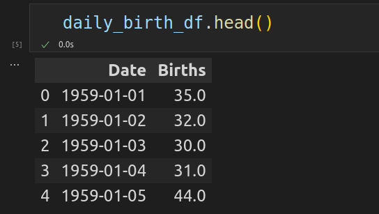

# CNN_timeseries_forecast

Timesiries forecasting using Convolutional neural network (CNN).

# Daily Female Births Dataset

This dataset describes the number of daily female births in California in 1959. The units are a count and there are 365 observations. The source of the dataset is credited to Newton (1988).

Below is a plot of the entire dataset.

Dataset has two columns: Date and Births.

# Dataset Split

Training dataset will have 55 percent of the data (200 observations).
Validation dataset will have 45 percent of the data (165 observations).

To make this task a supervised learning task we need to split our data to sequences. To predict next observation we will use previous three observation.

# CNN Forecast Model

Inside our model we will have one 1D convolution layer with 3 input channels and 64 output channels. Then we will have activation function ReLU and 2 fully connected layers. Output is gonna be one number (prediction).

We will use optimizer Adam and loss function MSE.

# Training

We will train our model on 200 epochs and store train and validation losses.

Below is a plot of train and validation losses.

# Prediction

And then we will try to make a prediction.

